::: {.content-hidden}

:::

# Motivation

## Motivations for the stiffened edge structure

::: {.fancy-slide style="--pad-bottom:920px"}
::: {.free-card style="--x:18%; --y:28%; --w:500px; --rot:-4deg; --z:3; --origin:50% 10%; --scale:1.5  "}
::: {.card-body}

![Origami gripper[@ogripper]](videos/Origami Robot Gripper_clip.gif){width=500px}

:::
:::

::: {.free-card style="--x:51%; --y:65%; --w:500px; --rot:4deg; --z:0; --origin:50% 10%; --scale:1.5  "}
::: {.card-body}

![Dome gripper[@Sholl2024]](videos/output2.gif){width=500px}

:::
:::

::: {.free-card style="--x:80%; --y:25%; --w:500px; --rot:-4deg; --z:3; --origin:50% 10%; --scale:1.5  "}
::: {.card-body}

![Crawling actuators[@Sholl2024]](videos/dome2.gif){width=500px}
:::
:::

:::

## Motivations for the stiffened edge structure

::: {.fancy-slide style="--pad-bottom:920px"}
::: {.free-card style="--x:20%; --y:28%; --w:500px; --rot:4deg; --z:3; --origin:50% 10%; --scale:1.5  "}
::: {.card-body}
![Bistable structures[@mungekar2023design]](videos/bistable.gif){width=500px}
:::
:::

::: {.free-card style="--x:49%; --y:63%; --w:500px; --rot:-4deg; --z:3; --origin:50% 10%; --scale:1.5  "}
::: {.card-body}

![Buckling of Epithelium[@trushko2020buckling]](videos/monolayer.gif){width=500px}

:::
:::

::: {.free-card style="--x:80%; --y:25%; --w:500px; --rot:-4deg; --z:2; --origin:50% 10%; --scale:1.5  "}
::: {.card-body}

![Insect wings[@faber2018bioinspired]](videos/wing.gif){width=500px}

:::
:::

:::

## Motivations for the stiffened edge structure

::: {.fancy-slide style="--pad-bottom:920px"}
::: {.free-card style="--x:20%; --y:28%; --w:500px; --rot:-4deg; --z:3; --origin:50% 10%; --scale:1.5  "}
::: {.card-body}
![Intestinal crypt formation[@yang2021cell]](videos/intenstine.gif){width=500px}
:::
:::

::: {.free-card style="--x:51%; --y:63%; --w:400px; --rot:4deg; --z:3; --origin:50% 10%; --scale:1.5  "}
::: {.card-body}

![Soap-film with elastic ring[@box2020dynamic]](videos/soapfilm1.gif){width=500px}

:::
:::

::: {.free-card style="--x:80%; --y:30%; --w:400px; --rot:-4deg; --z:2; --origin:50% 10%; --scale:1.5  "}
::: {.card-body}

![Soap-film with elastic band[@box2020dynamic]](videos/soapfilm2.gif){width=500px}

:::
:::

:::

## Tools for the Study

::: {.fancy-slide style="--pad-bottom:50px"}

**Bifurcation Theory**

:::{.compact}

- The fundamental concepts of Bifurcation, L-S Reduction etc.[@Kielhofer]
- Application of Symmetry in mechanical system. [@Healey90]

:::

**Exploitation of Symmetry**

:::{.compact}
- Using Symmetries to prove the existence of global bifurcaion branches [@healey1988]
- Application in elastostatics[@healey881]
:::

**Numerical continuation using symmetry reduction**
- Axial Shell[@Wohlever95]
- Wohlever[@Wohlever]
<!--Cell fate coordinates mechano-osmotic forces in intestinal crypt formation -->
:::
## Description of the system
::: {.fancy-slide style="--pad-bottom:0px"}
![Schematic illustration of the notation used in the description of rod-plate model. The thickness of rod is exagerrated[@das2025equilibriumcircularvonkarmanplate]](images/rp_configs.svg){width=1500px}
:::

# Formulation

## Kinematic fields

::: {.fancy-slide style="--pad-bottom:920px"}
::: {.free-card style="--x:25%; --y:45%; --w:600px; --rot:0deg; --z:3; --origin:50% 10%; --scale:1.2  "}
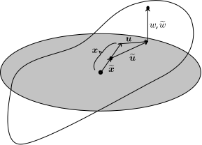{width=800px}
:::
::: {.free-card style="--x:12%; --y:25%; --w:600px; --rot:0deg; --z:3; --origin:50% 10%; --scale:0.75  "}
::: {.card-body}
$$ \hcon{\mbs{x}}=\frac{\scon{\mbs{x}}}{\lambda}, \quad \text{where }\lambda{\dfn}\frac{\dia_{P}}{\dia_{R}}$$
:::
:::

::: {.free-card style="--x:41%; --y:20%; --w:900px; --rot:0deg; --z:3; --origin:50% 10%; --scale:0.7  "}
::: {.card-body}
$$ \scon{\mbs{u}}:\scon{\Omega}\to\Epl,\quad \scon{w}:\scon{\Omega}\to\mathbb{R} $$
$$ \hcon{\mbs{u}}(\hcon{\mbs{x}})%=\hcon{\mbs{u}}\left(\frac{\scon{\mbs{x}}}{\lambda}\right)
				=\scon{\mbs{u}}(\scon{\mbs{x}})-(\frac{1}{\lambda}-1)\scon{\mbs{x}},\quad
				%\label{eq:inplane_disp_trans}\\
				\hcon{w}(\hcon{\mbs{x}})%=\hcon{w}\left(\frac{\scon{\mbs{x}}}{\lambda}\right)
				=\scon{w}(\scon{\mbs{x}}) $$
:::
:::
::: {.fragment}
::: {.free-card style="--x:75%; --y:55%; --w:600px; --rot:0deg; --z:3; --origin:50% 10%; --scale:1 "}
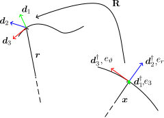{width=800px}
:::

::: {.free-card style="--x:63%; --y:25%; --w:400px; --rot:0deg; --z:3; --origin:50% 10%; --scale:0.6 "}
::: {.card-body}
$$ \hcon{\mbs{r}}:\hcon{\Gamma}\to\EuS $$
$$ \hcon{\mbs{g}}:\hcon{\Gamma}\to\EuS $$
:::
:::

::: {.free-card style="--x:84%; --y:25%; --w:1100px; --rot:0deg; --z:3; --origin:50% 10%; --scale:0.57 "}
::: {.card-body}
$$ {\hcon{\mbf{R}}}(\hcon{\mbs{g}})\dfn\frac{1}{1+{\hcon{\mbs{g}}}\cdot\hcon{\mbs{g}}}(({1-\hcon{\mbs{g}}\cdot\hcon{\mbs{g}}})\mbf{I}+{2}{\hcon{\mbs{g}}}\otimes\hcon{\mbs{g}}+{2}\mrm{skw}(\hcon{\mbs{g}})) $$
:::
:::
:::
::: {.free-card style="--x:50%; --y:80%; --w:900px; --rot:0deg; --z:3; --origin:50% 10%; --scale:0.7 " .fragment} 
::: {.card-body}
Compatibility relation:
$$ \hcon{\mbs{r}}(\hcon{s})-\hcon{\mbs{x}}(\hcon{s})=\hcon{\mbs{u}}(\hcon{\mbs{x}}(\hcon{s}))+\hcon{w}(\hcon{\mbs{x}}(\hcon{s}))\e{3}$$
  $$\text{for all $\hcon{s}\in\hcon{\Gamma}$}$$
:::
:::

:::

## Strains and Constitutive relationship

::: {.fancy-slide style="--pad-bottom:920px"}
::: {.free-card style="--x:20%; --y:30%; --w:800px; --rot:0deg; --z:3; --origin:50% 10%; --scale:0.7 "}
::: {.card-body}
$$\text{Strains in plate }(\scon{\Omega}) $$
$$\scon{\mbf{E}}{\dfn}\frac{1}{2}\left(\scon{\nabla}\scon{\mbs{u}}+\scon{\nabla}\scon{\mbs{u}}^{\top}+\scon{\nabla}\scon{w}\otimes\scon{\nabla}\scon{w}\right)$$
$$\scon{\mbf{K}}{\dfn}-\scon{\nabla}\scon{\nabla}\scon{w}$$
:::
:::

::: {.fragment}
::: {.free-card style="--x:60%; --y:30%; --w:800px; --rot:0deg; --z:3; --origin:50% 10%; --scale:0.7 "}
::: {.card-body}
$$\text{Strains in Rod }(\scon{\Gamma}) $$
$$\scon{\Krod}{\dfn}\scon{\dd{3}}^\gr\W(\scon{\mbf{R}}^{\top}\scon{\mbf{R}}'\scon{\dd{3}}^{\gr})$$
$$\scon{\Trod}{\dfn}\scon{\dd{2}}^{\gr}\cdot(\scon{\mbf{R}}^{\top}\scon{\mbf{R}}'\scon{\dd{1}}^{\gr})$$
:::
:::

::: {.free-card style="--x:85%; --y:30%; --w:800px; --rot:0deg; --z:3; --origin:50% 10%; --scale:0.5 "}
::: {.card-body}
$$\text{Constraints on Rod }(\scon{\Gamma}) $$
$$\scon{\mbs{r}}'\cdot\scon{\mbf{R}}\scon{\dd{3}}^{\gr}-1=0$$
$$\scon{\mbs{r}}'\W\left(\scon{\mbf{R}}\scon{\dd{3}}^{\gr}\right)=\mbs{0}$$
:::
:::
:::

::: {.fragment}
::: {.free-card style="--x:19%; --y:60%; --w:1000px; --rot:0deg; --z:3; --origin:50% 10%; --scale:0.7 "}
::: {.card-body}
$$\text{Strain energy in Plate }(\scon{\Omega}) $$
$$\what{W}_{m}(\scon{\mbf{E}})\dfn\frac{Eh}{2(1-\nu^2)}\big(\nu(\scon{\mbf{E}})^2+(1-\nu){\scon{\mbf{E}}}\Tdot{\scon{\mbf{E}}}\big)$$
$$\what{W}_{b}(\scon{\mbf{K}})\dfn\frac{Eh^3}{24(1-\nu^2)}\big(\nu(\scon{\mbf{K}})^2+(1-\nu){\scon{\mbf{K}}}\Tdot{\scon{\mbf{K}}}\big)$$
:::
:::
:::
::: {.fragment}
::: {.free-card style="--x:70%; --y:60%; --w:1000px; --rot:0deg; --z:3; --origin:50% 10%; --scale:0.7 "}
::: {.card-body}
$$\text{Strain energy in Rod }(\scon{\Gamma}) $$
$$\what{W}_{R}(\scon{\Krod},\scon{\Trod})\dfn\frac{1}{2}\left(\what{\Ebnd}\scon{\Krod}\cdot\scon{\Krod}+\what{\Etwst}\scon{\Trod}^2\right)$$
:::
:::
:::
::: {.fragment}
::: {.free-card style="--x:37%; --y:90%; --w:2000px; --rot:0deg; --z:3; --origin:50% 10%; --scale:0.6 "}
::: {.card-body}
$$\text{Potential Energy Fiunctional}$$
$$\what{\mcl{V}}(\hcon{\mbs{u}}, \hcon{w}, \hcon{\mbf{R}}, n_{||},\mbs{n}^{L},{\varpi})\dfn\int_{\scon{\Omega}}\left(\what{W}_{m}(\scon{\mbf{E}})+\what{W}_{b}(\scon{\mbf{K}})\right)\mrm{d}\scon{A}+\int_{\scon{\Gamma}}\what{W}_{R}(\scon{\Krod},\scon{\Trod})\mrm{d}\scon{l}$$
$$\quad+\int_{\scon{\Gamma}}\what{n}_{||}(\scon{\mbs{r}}'\cdot\scon{\mbf{R}}\scon{\dd{3}}^{\gr}-1)\mrm{d}\scon{l}+\int_{\scon{\Gamma}}\what{\mbs{n}}^{L}\cdot(\scon{\mbs{r}}'\W\left(\scon{\mbf{R}}\scon{\dd{3}}^{\gr}\right))\mrm{d}\scon{l}
+\int_{\scon{\Gamma}}\what{\varpi}\what{\mbs{n}}^{L}\cdot(\scon{\mbf{R}}\scon{\dd{3}}^{\gr})\mrm{d}\scon{l}$$
:::
:::

::: {.free-card style="--x:77%; --y:90%; --w:300px; --rot:0deg; --z:3; --origin:50% 10%; --scale:0.6 "}
::: {.card-body}
$$\what{n}_{||} :\hcon{\Gamma}\to\mathbb{R}$$
$$\what{\mbs{n}}^{L} :\hcon{\Gamma}\to\EuS$$
$$\what{\varpi} :\hcon{\Gamma}\to\mathbb{R}$$
:::
:::
:::
:::

## Equations of equilibrium

::: {.fancy-slide style="--pad-bottom:920px"}
::: {.free-card style="--x:25%; --y:50%; --w:1200px; --rot:0deg; --z:3; --origin:50% 10%; --scale:0.7 "}
::: {.card-body}
$$\hcon{\nabla}\cdot{\hcon{\mbf{N}}}=\mbs{0}$$
$$\hcon{\nabla}\cdot({\hcon{\mbf{N}}}\hcon{\nabla} \hcon{w}+\hcon{\nabla}\cdot{\hcon{\mbf{M}}})=0$$
$$(\hcon{\mbs{m}}_{\perp}+\hcon{\mbs{m}}_{||})'-\mbs{n}\W\hcon{\mbs{r}}'-{\varpi}\hcon{\dd{3}}\W\mbs{n}^{L}=\mbs{0}$$
$$(\mbf{I}-\e{3}\otimes\e{3})\mbs{n}'-\lambda {\hcon{\mbf{N}}}\hcon{\mbs{\nu}}=\mbs{0}$$
$$\mbs{n}'\cdot\e{3}-(( {\hcon{\mbf{N}}}\hcon{\nabla} \hcon{w}+\hcon{\nabla}\cdot {\hcon{\mbf{M}}})\cdot\hcon{\mbs{\nu}}+\hcon{\nabla}(\hcon{{\tgt}}\cdot {\hcon{\mbf{M}}}\hcon{\mbs{\nu}})\cdot\hcon{{\tgt}})=0$$
$$\hcon{\mbs{\nu}}\cdot {\hcon{\mbf{M}}}\hcon{\mbs{\nu}}=0$$
$$\hcon{\mbs{r}}'\cdot\hcon{\dd{3}}-1=0$$
$$\hcon{\mbs{r}}'\W\hcon{\dd{3}}+{\varpi}\hcon{\dd{3}}=\mbs{0}$$
$$\mbs{n}^{L}\cdot\hcon{\dd{3}}=0$$
:::
:::

::: {.free-card style="--x:50%; --y:73%; --w:1100px; --rot:0deg; --z:3; --origin:50% 10%; --scale:0.6 "}
::: {.card-body}
$$\mbs{n}\dfn-\mbs{n}^{L}\W(\hcon{\mbf{R}}\dd{3}^{\gr})+n_{||}\hcon{\mbf{R}}\dd{3}^{\gr},\ \tgt\dfn\e{\vartheta},\ \mbs{\nu}\dfn\e{r}$$
$$\hcon{\mbf{N}}\dfn\frac{12}{\lambda}\left((\nu\text{ tr}\hcon{\mbf{E}})\mbf{I}+(1-\nu)\hcon{\mbf{E}}\right)$$
$$\ +6\frac{1-\lambda}{\lambda^{2}}\left((\nu\mrm{ tr}(\hcon{\nabla}\hcon{w}\otimes\hcon{\nabla}\hcon{w}))\mbf{I}+(1-\nu)\hcon{\nabla}\hcon{w}\otimes\hcon{\nabla}\hcon{w}\right)$$
$$\ +12(1+\nu)\frac{1-\lambda}{\lambda}\mbf{I}$$
$$\hcon{\mbf{M}}\dfn\frac{1}{\lambda^{2}}h^2\left((\nu\text{ tr}\hcon{\mbf{K}})\mbf{I}+(1-\nu)\hcon{\mbf{K}}\right)$$
:::
:::
::: {.fragment}
::: {.free-card style="--x:30%; --y:88%; --w:1500px; --rot:0deg; --z:4; --origin:50% 10%; --scale:0.7 "}
::: {.card-body}
$$\hcon{\mbs{u}}(\hcon{\mbs{x}})=\mbs{0},\ \hcon{w}(\hcon{\mbs{x}})=0,\ \hcon{\mbs{g}}(\hcon{\rots}) = \mbs{0},\ \mbs{n}(\hcon{\rots})=6\dia_{R}(1+\nu)(1-\lambda)(-1)\hcon{{\tgt}}(\hcon{\rots})$$
:::
:::
:::

::: {.fragment}
::: {.free-card style="--x:55%; --y:7%; --w:400px; --rot:0deg; --z:3; --origin:50% 10%; --scale:0.6 "}
::: {.card-body}
$$\mathfrak{F}(\mbs{V}, \lambda)=\mbs{0}$$
:::
:::
:::

::: {.fragment}
::: {.free-card style="--x:75%; --y:36%; --w:1500px; --rot:0deg; --z:9; --origin:50% 10%; --scale:0.6 "}
::: {.card-body}
$$\mathfrak{F}(\mbs{V}, \lambda) := 
\left(
\begin{aligned}
& \nabla \cdot \mbf{N} \\
& \nabla \cdot (\mbs{f} + \nabla \cdot \mbf{M}) \\
& 12((1-\nu)\mbf{E}_\lambda + \nu(\text{tr } \mbf{E}_\lambda)\mbf{I}) - \mbf{N} \\
& -\frac{h^2}{\lambda^2}((1-\nu)\nabla^2 z + \nu\Delta z \mbf{I}) - \mbf{M} \\
& \mbs{f} - \frac{1}{\lambda}(12(1+\nu)(1-\lambda)\nabla z + \mbf{N}\nabla z) \\
& \mbs{m}' - (\mbs{n} + \frac{12}{\alpha}(1+\nu)(\lambda-1)\tgt) \wedge (\tgt + \mbs{v}' + z'\e{3}) \\
& \tgt + \mbs{v}' + z'\mbs{e}_3 - \mbf{R}(\mbs{g})[\tgt]
\end{aligned}
\right)$$
:::
:::

::: {.free-card style="--x:85%; --y:73%; --w:1500px; --rot:0deg; --z:3; --origin:50% 10%; --scale:0.4 "}
::: {.card-body}
$$\mbf{E}_\lambda := \frac{1}{2}(\nabla \mbs{v} + \nabla \mbs{v}^\top + \frac{1}{\lambda}\nabla z \otimes \nabla z), \quad \mbs{m} := \mbs{m}_\perp + \mbs{m}_{||}$$
$$\mbs{m}_\perp := \Ebnd \mbf{R}(\mbs{g})(\tgt \wedge \mathfrak{R}_{\mbs{g}}\tgt), \quad \mbs{m}_{||} := \Etwst (\mbs{\nu} \cdot (\mathfrak{R}_{\mbs{g}}\e{3}))\mbf{R}(\mbs{g})[\tgt]$$
$$\mathfrak{R}_{\mbs{g}} := (\mbf{R}(\mbs{g}))^\top (\mbf{R}(\mbs{g}))', \quad \mbf{R}(\mbs{g}) := \frac{((1-\mbs{g} \cdot \mbs{g})\mathbf{I} + 2\mbs{g} \otimes \mbs{g} + 2\text{skw}(\mbs{g}))}{1 + \mbs{g} \cdot \mbs{g}}$$
$$\mbs{V}\dfn\mylongvec{\hcon{\mbs{v}},\hcon{z},\mbf{N}, \mbf{M},\mbs{f},\mbs{g},\mbs{n}}$$
:::
:::
:::

::: {.fragment}
::: {.free-card style="--x:80%; --y:90%; --w:1500px; --rot:0deg; --z:3; --origin:50% 10%; --scale:0.5 "}
::: {.card-body}
$$ \text{On } \Gamma, $$
$$(\mbf{I} - \e{3} \otimes \e{3})\mbs{n}' - \mbf{N}\mbs{\nu} = \mbf{0}$$
$$\mbs{n}' \cdot \e{3} - (\mbs{f} \cdot \mbs{\nu} + (\nabla \cdot \mbf{M}) \cdot \mbs{\nu} + \nabla(\tgt \cdot \mbf{M}\mbs{\nu}) \cdot \tgt) = 0$$
$$\mbs{\nu} \cdot \mbf{M}\mbs{\nu} = 0$$
:::
:::
:::

:::

## Physical Interpretation of the variables
::: {.fancy-slide style="--pad-bottom:920px"}
::: {.free-card style="--x:20%; --y:37%; --w:720px; --rot:0deg; --z:1; --scale:1  " }
::: {.card-body}
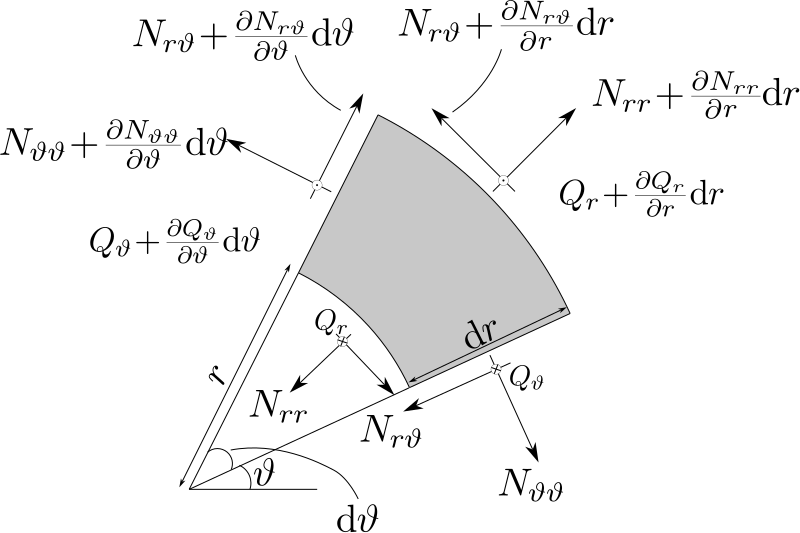{width=1200px}
:::
:::

::: {.free-card style="--x:65%; --y:30%; --w:720px; --rot:0deg; --z:1; --scale:1  " .fragment}
::: {.card-body}
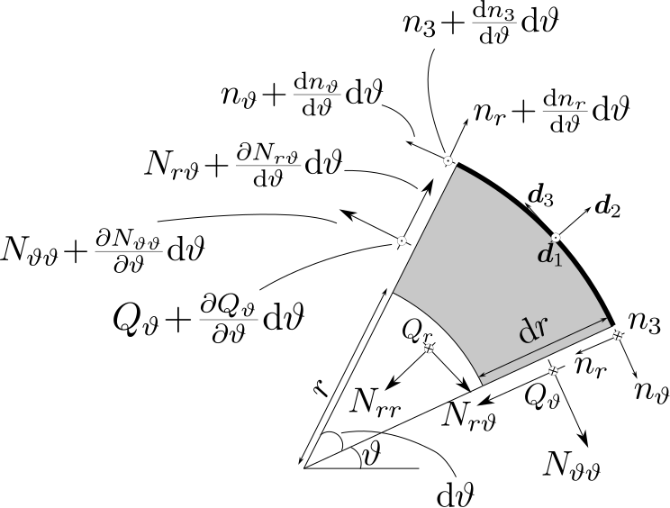{width=1200px}
:::
:::

::: {.free-card style="--x:35%; --y:70%; --w:720px; --rot:0deg; --z:1; --scale:1  " .fragment}
::: {.card-body}
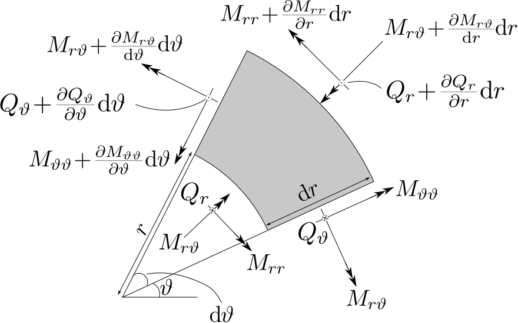{width=1200px}
:::
:::

::: {.free-card style="--x:80%; --y:65%; --w:720px; --rot:0deg; --z:1; --scale:1  " .fragment}
::: {.card-body}
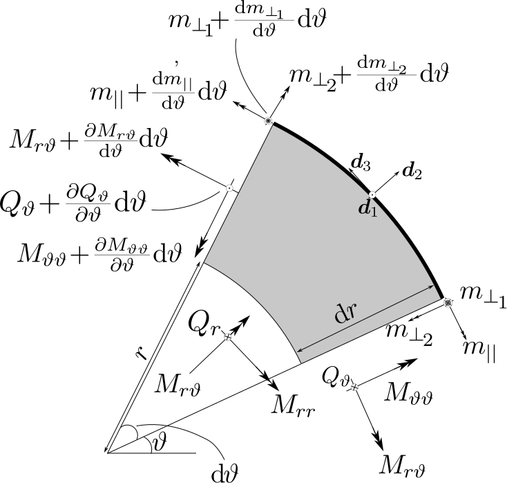{width=1200px}
:::
:::
:::

# Methodology

## Linearization and Null Spaces
::: {.fancy-slide style="--pad-bottom:920px"}
::: {.free-card style="--x:27%; --y:50%; --w:1500px; --rot:0deg; --z:2; --origin:50% 10%; --scale:0.7 "}
::: {.card-body}
$$\mfk{L}(\lambda)[\mbs{X}]=
	\left(\begin{aligned}
		&\hcon{\nabla}\cdot\mbf{P},\\
		&\hcon{\nabla}\cdot\left(\mbs{f}+\hcon{\nabla}\cdot\mbf{M}\right),\\
		&6\left((1-\nu)\left(\hcon{\nabla}\mbs{v}+\hcon{\nabla}\mbs{v}^{\top}\right)+2\nu\hcon{\nabla}\cdot\mbs{v}\mbf{I}\right)-\mbf{P},\\
		&-\frac{h^2}{\lambda^2}((1-\nu)\hcon{\nabla}^{2}{\wpb}+\nu\hcon{\Delta}{\wpb}\mbf{I})-\mbf{M},\\
		&{{\mbs{f}}}-\frac{12}{\lambda}(1+\nu)(1-\lambda)\hcon{\nabla}{{\wpb}},\\
		&(2\mbf{I}+2(\Etwst-\Ebnd)\hcon{{\tgt}}\otimes\hcon{{\tgt}})[\check{\mbs{s}}'']\\
		&\quad\quad-2\alpha(\Etwst-\Ebnd)(\hcon{{\tgt}}\otimes\hcon{\mbs{\nu}}+\hcon{\mbs{\nu}}\otimes\hcon{{\tgt}})[\check{\mbs{s}}']\\
		&\quad\quad\quad+\hcon{{\tgt}}\W(\check{\mbs{n}}-\frac{12}{\alpha}(1+\nu)(\lambda-1)(\edge{\mbs{v}}'+\wpb'\e{3})),\\
		&\edge{\mbs{v}}'+\edge{z}'\e{3}-2\check{\mbs{s}}\W\hcon{{\tgt}}.
	\end{aligned}\right)$$
:::
:::

::: {.free-card style="--x:20%; --y:75%; --w:1000px; --rot:0deg; --z:2; --origin:50% 10%; --scale:0.5 "}
::: {.card-body}
$$ \mbs{X}=\mylongvec{\mbs{v},{\wpb},\mbf{P},\mbf{M},\mbs{f},\mbs{\dir{s}},\mbs{\dir{n}}} $$
:::
:::

::: {.fragment}
::: {.free-card style="--x:76%; --y:35%; --w:3000px; --rot:0deg; --z:3; --origin:50% 10%; --scale:0.48 "}
::: {.card-body}
$$\text{Planar } k\geq2$$
$$v_{r}(r,\vartheta)=A_{0}r+\sum\limits_{k=1}^{\infty}\left(-A_{k}r^{k-1}-C_{k}\frac{k-2+\nu(k+2)}{4+k(1+\nu)}r^{k+1}\right)\cos(k\vartheta)$$
$$\ +\sum\limits_{k=1}^{\infty}\left(B_{k}r^{k-1}+D_{k}\frac{k-2+\nu(k+2)}{4+k(1+\nu)}r^{k+1}\right)\sin(k\vartheta),\label{vr_sol_form}$$
$$v_{\vartheta}(r,\vartheta)=B_{0}r+\sum\limits_{k=1}^{\infty}\left(B_{k}r^{k-1}+D_{k}r^{k+1}\right)\cos(k\vartheta)
		+\sum\limits_{k=1}^{\infty}\left(A_{k}r^{k-1}+C_{k}r^{k+1}\right)\sin(k\vartheta)$$
:::
:::

::: {.free-card style="--x:80%; --y:52%; --w:3000px; --rot:0deg; --z:3; --origin:50% 10%; --scale:0.45 "}
::: {.card-body}
$$\lambda_{k}=\frac{{48+k (24-24 \nu)+\Ebnd k^4 (3 \alpha^3-\alpha^3 \nu)}{+k^2 (-36-3 \Ebnd\alpha^3 -24 \nu+\Ebnd \alpha^3 \nu+12 \nu^2)}}{12 \left(\nu ^2-2 \nu -3\right) \left(k^2-1\right)}$$
$$A_{k}:C_{k}=B_{k}:D_{k}=-\frac{(k+1) (-2 \nu +\nu k+k+2)}{\alpha ^2 (k-1) (\nu k+k+4)}:1$$
:::
:::
:::
::: {.fragment}
::: {.free-card style="--x:77%; --y:65%; --w:3000px; --rot:0deg; --z:3; --origin:50% 10%; --scale:0.45 "}
::: {.card-body}
$$\text{Non planar }\lambda<1$$
$${\wpb}(r,\vartheta)=E_{0}+\sum\limits_{k=2}^{\infty}\Big((A_{k}r^{k}+C_{k}I_{k}(\sqrt{|a_{\lambda}|} r ))\cos(k\vartheta)+(B_{k}r^{k}+D_{k}I_{k}(\sqrt{|a_{\lambda}|} r ))\sin(k\vartheta)\Big)$$
:::
:::

::: {.free-card style="--x:75%; --y:85%; --w:4000px; --rot:0deg; --z:3; --origin:50% 10%; --scale:0.45 "}
::: {.card-body}
$$\text{Non planar }\lambda>1$$
$${\wpb}(r,\vartheta)=C_{0}J_{0}(\sqrt{|a_{\lambda}|} r )$$
$$\ +\sum\limits_{k=1}^{\infty}\Big((A_{k}r^{k}+C_{k}J_{k}(\sqrt{|a_{\lambda}|} r ))\cos(k\vartheta)+(B_{k}r^{k}+D_{k}J_{k}(\sqrt{|a_{\lambda}|} r ))\sin(k\vartheta)\Big)$$
:::
:::

::: {.free-card style="--x:85%; --y:95%; --w:800px; --rot:0deg; --z:3; --origin:50% 10%; --scale:0.45 "}
::: {.card-body}
$$a_{\lambda}=12{(1+\nu)}(\lambda-\lambda^2)/{h^2}$$
:::
:::
:::

:::

## Local Bifurcation

::: {.fancy-slide style="--pad-bottom:920px"}

::: {.free-card style="--x:33%; --y:60%; --w:1500px; --rot:0deg; --z:3; --origin:50% 10%; --scale:0.8 "}
**Theorem** *Suppose that* $\mathscr{F}$ *is at least twice differentiable with respect to its arguments and there exists a null vector*

$$X \in \mathcal{N}(\mathcal{L}(\lambda_0))$$

*that defines proper isotropy subgroup H. Let $\mathcal{L}_{\mathrm{H}}(\lambda_0)$ be the H-reduced linearized operator about solution $(0,\lambda_0)$. Assume the following:*

1. $\dim\!\big(\mathcal{N}(\mathcal{L}_{\mathrm{H}}(\lambda_0))\big)=1$.

2. $D_{\lambda}\mathcal{L}_{\mathrm{H}}(\lambda_0)[X]\not\in \mathcal{R}(\mathcal{L}_{\mathrm{H}}(\lambda_0))
\quad \forall X\in\mathcal{N}(\mathcal{L}_{\mathrm{H}}(\lambda_0))$
*(provided $\mathcal{L}_{\mathrm{H}}(\lambda_0)$ is Fredholm of index zero.)*

*Then, $(0,\lambda_0)$ is a bifurcation point of (2.2.23) such that in every small neighbourhood of $(0,\lambda_0)$, there are non-trivial solution*

$$(V_*,\lambda_*) \in D_H \times \mathbb{R}^+ .$$

*Moreover, as $\dim(\mathcal{N}(\mathcal{L}_{\mathrm{H}}(\lambda_0)))=\operatorname{codim}(\mathcal{R}(\mathcal{L}_{\mathrm{H}}(\lambda_0)))=1$, there exists a unique, local, bifurcating branch of solution of form*

$$t \mapsto (V(t),\lambda(t)) \in D_H \times \mathbb{R}^+ .$$

:::

::: {.free-card style="--x:85%; --y:25%; --w:500px; --rot:0deg; --z:0; --origin:50% 10%; --scale:1  " .fragment}
::: {.card-body}
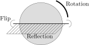{width=500px}
:::
:::

::: {.free-card style="--x:72%; --y:55%; --w:420px; --rot:0deg; --z:0; --origin:50% 10%; --scale:1  " .fragment}
::: {.card-body}
{width=420px}
:::
:::

::: {.free-card style="--x:90%; --y:75%; --w:420px; --rot:0deg; --z:0; --origin:50% 10%; --scale:1  " .fragment}
::: {.card-body}
{width=420px}
:::
:::

:::

## Symmetry Groups under consideration
::: {.fancy-slide style="--pad-bottom:920px"}
::: {.free-card style="--x:15%; --y:25%; --w:500px; --rot:0deg; --z:0; --origin:50% 10%; --scale:1  "}
::: {.card-body}
{width=500px}
:::
:::

::: {.free-card style="--x:15%; --y:54%; --w:700px; --rot:0deg; --z:0; --origin:50% 10%; --scale:0.7  "}
::: {.card-body}
$$\mcl{G}=\{r_\theta,er_\theta,fr_\theta,fer_\theta\},$$
$$\text{where }\theta\in{\R}_{2\pi}$$
:::
:::

::: {.free-card style="--x:15%; --y:77%; --w:700px; --rot:0deg; --z:0; --origin:50% 10%; --scale:0.7  "}
::: {.card-body}
$$ \quad r_{2\pi}=1, \quad e^2=1 $$
$$ f^2=1,\quad efef=1 $$
$$ er_{\theta}er_{\theta}=1, \quad fr_{\theta}fr_{\theta}=1 $$
:::
:::

::: {.fragment}
::: {.free-card style="--x:40%; --y:35%; --w:450px; --rot:0deg; --z:0; --origin:50% 10%; --scale:1  "}
::: {.card-body}
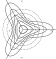{width=500px}
:::
:::

::: {.free-card style="--x:45%; --y:77%; --w:1000px; --rot:0deg; --z:0; --origin:50% 10%; --scale:0.7  "}
::: {.card-body}
$$\mathtt{Z}_{k}=\{r_{\alpha}, r_{2\alpha},\dotsc,r_{k\alpha},er_{\alpha}, er_{2\alpha},\dotsc,er_{k\alpha},$$
$$\quad fr_{\alpha}, fr_{2\alpha},\dotsc,fr_{k\alpha},fer_{\alpha}, fer_{2\alpha},\dotsc,fer_{k\alpha}\}$$
$$\quad\text{where $\alpha=2\pi/k$}$$
:::
:::
:::

::: {.fragment}
::: {.free-card style="--x:64%; --y:25%; --w:450px; --rot:0deg; --z:0; --origin:50% 10%; --scale:1  "}
::: {.card-body}
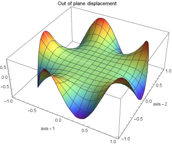{width=500px}
:::
:::

::: {.free-card style="--x:67%; --y:57%; --w:1000px; --rot:0deg; --z:1; --origin:50% 10%; --scale:0.7  "}
::: {.card-body}
$$\mathtt{D}_{k}=\{r_{\alpha}, r_{2\alpha},\dotsc,r_{k\alpha},er_{\alpha}, er_{2\alpha},\dotsc,er_{k\alpha}\}$$
$$\quad\text{where $\alpha=2\pi/k$}$$
:::
:::
:::

::: {.fragment}
::: {.free-card style="--x:87%; --y:25%; --w:450px; --rot:0deg; --z:0; --origin:50% 10%; --scale:1  "}
::: {.card-body}
{width=500px}
:::
:::

::: {.free-card style="--x:90%; --y:65%; --w:500px; --rot:0deg; --z:3; --origin:50% 10%; --scale:0.7  "}
::: {.card-body}
$$\mathtt{O}(2)=\{r_\theta,er_\theta\}$$
$$\text{where }\theta\in{\R}_{2\pi}$$
:::
:::
:::

:::

## Symmetry Operations
::: {.fancy-slide style="--pad-bottom:920px"}

::: {.free-card style="--x:10%; --y:15%; --w:600px; --rot:0deg; --z:1; --origin:50% 10%; --scale:0.6  "}
::: {.card-body}
$$\mbs{V}\dfn\mylongvec{\hcon{\mbs{v}},\hcon{z},\mbf{N}, \mbf{M},\mbs{f},\mbs{g},\mbs{n}}$$
:::
:::

::: {.free-card style="--x:30%; --y:37%; --w:1500px; --rot:0deg; --z:0; --origin:50% 10%; --scale:0.7  "}
::: {.card-body}
$$(\mcl{T}_\phi \mbs{V})(r, \theta) = \left( \mathbf{T}_\phi \mbs{v}, z, \mbf{T}_\phi \mbf{N} \mbf{T}_\phi^\top, \mbf{T}_\phi \mbf{M} \mbf{T}_\phi^\top, \mbf{T}_\phi \mbs{f}, \mbf{Z}_\phi \mbs{g}, \mbf{Z}_\phi \mbs{n} \right)^\top (r, \theta - \phi)$$
$$(\mcl{E} \mbs{V})(r, \theta) = \left( \mbf{J} \mbs{v}, z, \mbf{J} \mbf{N} \mbf{J}, \mbf{J} \mbf{M} \mbf{J}, \mbf{J} \mbs{f}, -\mbf{Q} \mbs{g}, -\mbf{Q} \mbs{n} \right)^\top (r, -\theta)$$
$$(\mcl{F} \mbs{V})(r, \theta) = \left( \mbf{J} \mbs{v}, -z, \mbf{J} \mbf{N} \mbf{J}, -\mbf{J} \mbf{M} \mbf{J}, -\mbf{J} \mbs{f}, \mbf{F} \mbs{g}, -\mbf{F} \mbs{n} \right)^\top (r, -\theta)$$
:::
:::

::: {.fragment}
::: {.free-card style="--x:15%; --y:60%; --w:500px; --rot:0deg; --z:0; --origin:50% 10%; --scale:0.7  "}
::: {.card-body}
$$\mbf{T}_{\phi} = \begin{bmatrix}
\cos \phi & -\sin \phi \\
\sin \phi & \cos \phi
\end{bmatrix}$$
:::
:::

::: {.free-card style="--x:35%; --y:60%; --w:400px; --rot:0deg; --z:0; --origin:50% 10%; --scale:0.7  "}
::: {.card-body}
$$\mbf{J} = \begin{bmatrix}
1 & 0 \\
0 & -1
\end{bmatrix}$$
:::
:::
:::

::: {.fragment}
::: {.free-card style="--x:65%; --y:20%; --w:600px; --rot:0deg; --z:0; --origin:50% 10%; --scale:0.7  "}
::: {.card-body}
$$\mbf{Z}_{\phi} = \begin{bmatrix}
\cos \phi  & -\sin \phi & 0 \\
\sin \phi & \cos \phi  & 0 \\
0 & 0 & 1
\end{bmatrix}$$
:::
:::

::: {.free-card style="--x:87%; --y:21%; --w:600px; --rot:0deg; --z:0; --origin:50% 10%; --scale:0.8  "}
::: {.card-body}
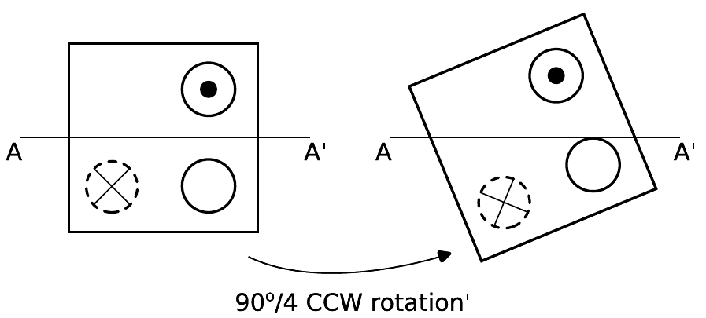{width=600px}
:::
:::
:::

::: {.fragment}
::: {.free-card style="--x:66%; --y:55%; --w:600px; --rot:0deg; --z:0; --origin:50% 10%; --scale:0.7  "}
::: {.card-body}
$$\mbf{Q} = \begin{bmatrix}
1  & 0 & 0 \\
0 & -1  & 0 \\
0 & 0 & 1
\end{bmatrix}$$
:::
:::

::: {.free-card style="--x:88%; --y:55%; --w:600px; --rot:0deg; --z:0; --origin:50% 10%; --scale:0.8  "}
::: {.card-body}
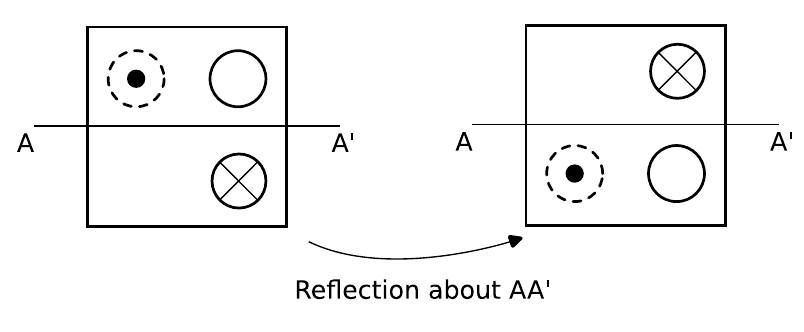{width=600px}
:::
:::
:::

::: {.fragment}
::: {.free-card style="--x:62%; --y:80%; --w:600px; --rot:0deg; --z:0; --origin:50% 10%; --scale:0.7  "}
::: {.card-body}
$$\mbf{F} = \begin{bmatrix}
1  & 0 & 0 \\
0 & -1  & 0 \\
0 & 0 & -1
\end{bmatrix}$$
:::
:::

::: {.free-card style="--x:85%; --y:80%; --w:600px; --rot:0deg; --z:0; --origin:50% 10%; --scale:0.8  "}
::: {.card-body}
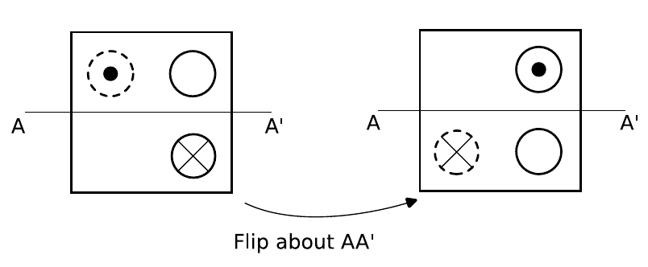{width=600px}
:::
:::
:::
:::

## Symmetry reduced spaces
::: {.fancy-slide style="--pad-bottom:920px"}

::: {.free-card style="--x:10%; --y:15%; --w:600px; --rot:0deg; --z:1; --origin:50% 10%; --scale:0.7  "}
::: {.card-body}
$$\Big(\mcl{P}_{\mathtt{H}}\mbs{V}\Big)(r,\vartheta)=\mbs{V}(r,\vartheta)$$

:::
:::

::: {.free-card style="--x:10%; --y:35%; --w:500px; --rot:0deg; --z:1; --origin:50% 10%; --scale:0.7  "}
::: {.card-body}
$$\mcl{P}_{\mathtt{H}}\mbs{u}=\int_{\mathtt{H}}\mcl{T}_{\mathtt{H}}\mbs{u}\,\mathrm{d}\mu(g)$$
$$\text{where, }\int_{\mathtt{H}}\mathrm{d}\mu(g)=1$$
:::
:::

::: {.free-card style="--x:30%; --y:25%; --w:600px; --rot:0deg; --z:1; --origin:50% 10%; --scale:0.7  "}
::: {.card-body}
$$\mcl{P}_{\mathtt{H}}\mbs{u}=\frac{1}{\mathrm{size}(\mathtt{H})}\sum_{\mathtt{H}}\mcl{T}_{\mathtt{H}}\mbs{u}$$
:::
:::

::: {.fragment}
::: {.free-card style="--x:27%; --y:75%; --w:1400px; --rot:0deg; --z:1; --origin:50% 10%; --scale:0.7  "}
::: {.card-body}
$\mathtt{D}_{k}$-reduced space
$$\begin{pmatrix}
(v_r, v_\vartheta) \\
z \\
[N_{rr}, N_{\vartheta\vartheta}, N_{r\vartheta}] \\
[M_{rr}, M_{\vartheta\vartheta}, M_{r\vartheta}] \\
(f_r, f_\vartheta) \\
(\check{g}_r, \check{g}_\vartheta, \check{g}_3) \\
(\check{n}_r, \check{n}_\vartheta, \check{n}_3)
\end{pmatrix}(r, \vartheta)
=
\begin{pmatrix}
(v_r, -v_\vartheta) \\
z \\
[N_{rr}, N_{\vartheta\vartheta}, -N_{r\vartheta}] \\
[M_{rr}, M_{\vartheta\vartheta}, -M_{r\vartheta}] \\
(f_r, -f_\vartheta) \\
(-\check{g}_r, \check{g}_\vartheta, -\check{g}_3) \\
(-\check{n}_r, \check{n}_\vartheta, -\check{n}_3)
\end{pmatrix}(r, -\vartheta)$$

:::
:::
:::

::: {.fragment}
::: {.free-card style="--x:70%; --y:30%; --w:1400px; --rot:0deg; --z:1; --origin:50% 10%; --scale:0.7  "}
::: {.card-body}
$\mathtt{Z}_{k}$-reduced space
$$\begin{pmatrix}
(v_r, v_\vartheta) \\
z \\
[N_{rr}, N_{\vartheta\vartheta}, N_{r\vartheta}] \\
[M_{rr}, M_{\vartheta\vartheta}, M_{r\vartheta}] \\
(f_r, f_\vartheta) \\
(\check{g}_r, \check{g}_\vartheta, \check{g}_3) \\
(\check{n}_r, \check{n}_\vartheta, \check{n}_3)
\end{pmatrix}(r, \vartheta)
=
\begin{pmatrix}
(v_r, -v_\vartheta) \\
0 \\
[N_{rr}, N_{\vartheta\vartheta}, -N_{r\vartheta}] \\
[0, 0,0] \\
(0, 0) \\
(0, 0, -\check{g}_3) \\
(-\check{n}_r, \check{n}_\vartheta,0)
\end{pmatrix}(r, -\vartheta)$$

:::
:::
:::

::: {.fragment}
::: {.free-card style="--x:75%; --y:75%; --w:1200px; --rot:0deg; --z:1; --origin:50% 10%; --scale:0.7  "}
::: {.card-body}
$\mathtt{O}(2)$-reduced space
$$\begin{pmatrix}
(v_r, v_\vartheta) \\
z \\
[N_{rr}, N_{\vartheta\vartheta}, N_{r\vartheta}] \\
[M_{rr}, M_{\vartheta\vartheta}, M_{r\vartheta}] \\
(f_r, f_\vartheta) \\
(\check{g}_r, \check{g}_\vartheta, \check{g}_3) \\
(\check{n}_r, \check{n}_\vartheta, \check{n}_3)
\end{pmatrix}(r, \vartheta)
=
\begin{pmatrix}
(v_r, 0) \\
z \\
[N_{rr}, N_{\vartheta\vartheta}, 0] \\
[M_{rr}, M_{\vartheta\vartheta}, 0] \\
(f_r, 0) \\
(0, \check{g}_\vartheta, 0) \\
(0, \check{n}_\vartheta,0)
\end{pmatrix}(r)$$

:::
:::
:::

:::

## Transversality condition and adjoint operator
::: {.fancy-slide style="--pad-bottom:920px"}

::: {.free-card style="--x:20%; --y:25%; --w:1000px; --rot:0deg; --z:1; --origin:50% 10%; --scale:0.7  "}
::: {.card-body}
$$D_{\lambda}\mfk{L}_{\mathrm{H}}(\lambda_0)[X]\not\in \mathcal{R}(\mfk{L}_{\mathrm{H}}(\lambda_0))
\quad \forall X\in\mathcal{N}(\mfk{L}_{\mathrm{H}}(\lambda_0))$$
$$\implies 	\langle D_{\lambda}\mfk{L}_{\mathtt{H}}(\lambda_{0})[\mbs{X}],\mbs{Z}\rangle\neq0 $$
where, $\mfk{L}^{\ast}_{\mathtt{H}}(\lambda_{0})[\mbs{Z}]=\mbs{0}$
:::
:::

::: {.free-card style="--x:20%; --y:43%; --w:600px; --rot:0deg; --z:1; --origin:50% 10%; --scale:0.7  "}
::: {.card-body}
$$\langle\mfk{L}(\mbs{X}),\mbs{Z}\rangle=\langle\mbs{X},\mfk{L}^{\ast}(\mbs{Z})\rangle$$
:::
:::

::: {.fragment}
::: {.free-card style="--x:30%; --y:75%; --w:2500px; --rot:0deg; --z:1; --origin:50% 10%; --scale:0.6  "}
::: {.card-body}
$$\mfk{L}^{\ast}(\lambda)[\mbs{Z}]=
	\left(\begin{aligned}
		& -12(1-\nu)\hcon{\nabla}\cdot\mbf{S}-12\nu\hcon{\nabla}(\mbf{S}\Tdot\mbf{I}_{2}),\\
		&-\frac{h^2}{\lambda^2}(1-\nu)\hcon{\nabla}\cdot(\hcon{\nabla}\cdot\mbf{T})-\frac{h^2}{\lambda^2}\nu\hcon{\Delta}(\mbf{T}\Tdot\mbf{I}_{2})+\frac{12}{\lambda}(1+\nu)(1-\lambda)\hcon{\nabla}\cdot\mbs{g},\\
		&-\frac{1}{2}\left(\hcon{\nabla}\mbs{u}+\hcon{\nabla}\mbs{u}^{\top}\right)-\mbf{S},\\
		&\hcon{\nabla}^2w-\mbf{T},\\
		&\mbs{g}-\hcon{\nabla}w,\\
		&2(\mbf{I}+(\Etwst-\Ebnd)\hcon{{\tgt}}\otimes\hcon{{\tgt}})\mbs{\dir{q}}''-2\alpha(\Etwst-\Ebnd)(\hcon{{\tgt}}\otimes\hcon{\mbs{\nu}}+\hcon{\mbs{\nu}}\otimes\hcon{{\tgt}})\mbs{\dir{q}}'-2{\tgt}\W\mbs{\dir{h}},\\
		&\mbs{\dir{q}}\W\hcon{{\tgt}}-\edge{\mbs{u}}'-\edge{w}'\e{3},
	\end{aligned}\right)$$
:::
:::

::: {.free-card style="--x:20%; --y:90%; --w:600px; --rot:0deg; --z:1; --origin:50% 10%; --scale:0.7  "}
::: {.card-body}
$$\mbs{Z}\dfn\{\mbs{u},z,\mbf{S},\mbf{T},\mbs{g},\dir{\mbs{q}},\dir{\mbs{h}}\}$$
:::
:::
:::

::: {.fragment}
::: {.free-card style="--x:70%; --y:25%; --w:1600px; --rot:0deg; --z:1; --origin:50% 10%; --scale:0.7  "}
::: {.card-body}
For $\mathtt{Z}_{k}$-reduced problem
$$\langle D_{\lambda}\mfk{L}_{Z_{k}}(\lambda_{k})[\mbs{X}_{k}],\mbs{Z}_{k}\rangle=-\sqrt{(\mbs{u}\cdot\mbs{u})(\mbs{v}\cdot\mbs{v})}\frac{4 \pi (k-1)^2 (\nu -3)^2 \alpha ^{3-2 k}}{(k \nu +k-2 \nu +2)^2}\neq 0.$$
:::
:::
:::

::: {.fragment}
::: {.free-card style="--x:77%; --y:60%; --w:1200px; --rot:0deg; --z:0; --origin:50% 10%; --scale:0.65  "}
::: {.card-body}
For $\mathtt{D}_{k}$-reduced problem (determided numirically)
$$\langle D_{\lambda}\mfk{L}_{D_{k}}(\lambda_{k})[\mbs{X}_{k}],\mbs{Z}_{k}\rangle=\sqrt{\frac{\langle w,w\rangle}{\langle z,z\rangle}}\Bigg(\int_{\hcon{\Omega}} \frac{2h^2}{\lambda^3}W(\hcon{\nabla}^{2}z)\mrm{d}A$$
$$\quad + \int_{\hcon{\Omega}} \frac{12}{\lambda^2}(1+\nu)\hcon{\nabla}{{\wpb}}\cdot\hcon{\nabla}\wpb\mrm{d}A$$
$$\quad-\int_{\hcon{\Gamma}}\frac{12}{\alpha}(1+\nu)\edge{\wpb}'^2\mrm{d}s\Bigg)\ \neq 0$$
:::
:::
:::

::: {.fragment}
::: {.free-card style="--x:77%; --y:90%; --w:1200px; --rot:0deg; --z:0; --origin:50% 10%; --scale:0.5  "}
::: {.card-body}
For $\mathtt{O}(2)$-reduced problem
$$\langle D_{\lambda}\mfk{L}_{O(2)}(\lambda_{k})[\mbs{X}_{k}],\mbs{Z}_{k}\rangle=\sqrt{\frac{\langle w,w\rangle}{\langle z,z\rangle}}\Bigg(\int_{\hcon{\Omega}} \frac{2h^2}{\lambda^3}W(\hcon{\nabla}^{2}z)\mrm{d}A$$
$$\quad + \int_{\hcon{\Omega}} \frac{12}{\lambda^2}(1+\nu)\hcon{\nabla}{{\wpb}}\cdot\hcon{\nabla}\wpb\mrm{d}A\Big)\neq0$$
:::
:::
:::

:::

## Local bifurcation using Lyapunov–Schmidt reduction

::: {.fancy-slide style="--pad-bottom:920px"}
::: {.free-card style="--x:35%; --y:28%; --w:2000px; --rot:0deg; --z:1; --origin:50% 10%; --scale:0.7  "}
::: {.card-body}
$$\mathcal{D} = \mathcal{N}(\mathfrak{L}(\lambda_k)) \oplus \mathcal{D}_{0}, \quad \mathcal{R} = \mathcal{R}_{0} \oplus \mathcal{R}(\mathfrak{L}(\lambda_k))$$
$$\mathcal{A} : \mathcal{D} \to \mathcal{N}(\mathfrak{L}(\lambda_k)) \quad \text{and} \quad \mathcal{B} : \mathcal{R} \to \mathcal{R}_{0}$$
$$ \mfk{F}(\mbs{V},\lambda)=\mbs{0}\implies \left\{\begin{aligned}
		& \mcl{B}\mfk{F}(\mcl{A}\mbs{V}+(\mcl{I}-\mcl{A})\mbs{V},\lambda)=\mbs{0}\text{ (not locally invertible)}\\
    & (\mcl{I}-\mcl{B})\mfk{F}(\mcl{A}\mbs{V}+(\mcl{I}-\mcl{A})\mbs{V},\lambda)=\mbs{0} \text{ (locally invertible wrt, $(\mcl{I}-\mcl{A})\mbs{V}$ )}\\
	\end{aligned}\right.$$
:::
:::

::: {.fragment}
::: {.free-card style="--x:35%; --y:70%; --w:2000px; --rot:0deg; --z:1; --origin:50% 10%; --scale:0.7  "}
::: {.card-body}
$$ \lambda(0) = \lambda_c, \quad \dot{\lambda}(0) = -\frac{1}{2} \frac{\langle \mathrm{D}^2_{\boldsymbol{V}} \mathfrak{F}_{\mathtt{H}}[\boldsymbol{X}_{\mathtt{H}}, \boldsymbol{X}_{\mathtt{H}}], \boldsymbol{Z}_{\mathtt{H}}\rangle}{\langle \mathrm{D}_\lambda \mathfrak{L}_{\mathtt{H}}(\lambda_c)[\boldsymbol{X}_{\mathtt{H}}], \boldsymbol{Z}_{\mathtt{H}} \rangle}, \quad \ddot{\lambda}(0) = -\frac{1}{3} \frac{\langle \boldsymbol{Z}, \boldsymbol{Z}_{\mathtt{H}} \rangle}{\langle \mathrm{D}_\lambda \mathfrak{L}_{\mathtt{H}}(\lambda_c)[\boldsymbol{X}_{\mathtt{H}}], \boldsymbol{Z}_{\mathtt{H}} \rangle} $$
$$\boldsymbol{Z} := \mathrm{D}^3_{\boldsymbol{V}} \mathfrak{F}_{\mathtt{H}}(\boldsymbol{0}, \lambda_c)[\boldsymbol{X}_{\mathtt{H}}, \boldsymbol{X}_{\mathtt{H}}, \boldsymbol{X}_{\mathtt{H}}] - 3\mathrm{D}^2_{\boldsymbol{V}} \mathfrak{F}_{\mathtt{H}}(\boldsymbol{0}, \lambda_c)[\boldsymbol{X}_{\mathtt{H}}, \boldsymbol{Y}],$$
$$\boldsymbol{Y} := (\mathcal{I} - \mathcal{A})(\mathfrak{L}_{\mathtt{H}}(\lambda_c))^{-1}(\mathcal{I} - \mathcal{B})[\mathrm{D}^2_{\boldsymbol{V}} \mathfrak{F}_{\mathtt{H}}(\boldsymbol{0}, \lambda_c)[\boldsymbol{X}_{\mathtt{H}}, \boldsymbol{X}_{\mathtt{H}}]]$$
$$\mathcal{D}_{\mathtt{H}} = \mathcal{N}(\mathfrak{L}_{\mathtt{H}}(\lambda_k)) \oplus \mathcal{D}_{0\mathtt{H}}, \quad \mathcal{R}_{\mathtt{H}} = \mathcal{R}_{0\mathtt{H}} \oplus \mathcal{R}(\mathfrak{L}_{\mathtt{H}}(\lambda_k))$$
$$\mathcal{A} : \mathcal{D}_{\mathtt{H}} \to \mathcal{N}(\mathfrak{L}_{\mathtt{H}}(\lambda_k)) \quad \text{and} \quad \mathcal{B} : \mathcal{R}_{\mathtt{H}} \to \mathcal{R}_{0\mathtt{H}}$$
:::
:::
:::

::: {.fragment}
::: {.free-card style="--x:75%; --y:82%; --w:1000px; --rot:0deg; --z:1; --origin:50% 10%; --scale:0.7  "}
::: {.card-body}
$$ \lambda(t) = \lambda(0) + t\dot{\lambda}(0) + \frac{t^2}{2}\ddot{\lambda}(0) + o(t^2) $$
$$ \boldsymbol{V}(t) = \mathbf{0} + t\boldsymbol{X}_{\mathtt{H}} + \frac{1}{2}t^2(-\boldsymbol{Y}) + o(t^2) $$
:::
:::
:::

:::

## Symmetry-reduced finite element method (Plate Discretization)

::: {.fancy-slide style="--pad-bottom:920px"}

::: {.free-card style="--x:15%; --y:35%; --w:500px; --rot:0deg; --z:0; --origin:50% 10%; --scale:1  "}
::: {.card-body}
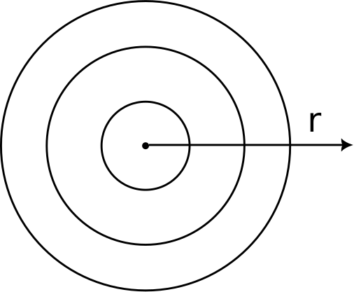{width=500px}

:::
:::

::: {.free-card style="--x:45%; --y:35%; --w:500px; --rot:0deg; --z:0; --origin:50% 10%; --scale:1  "}
::: {.card-body}
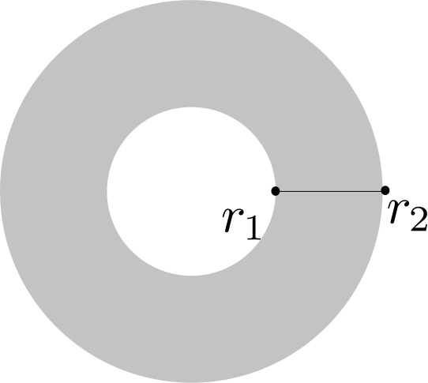{width=500px}

:::
:::

::: {.fragment}
::: {.free-card style="--x:75%; --y:25%; --w:800px; --rot:0deg; --z:0; --origin:50% 10%; --scale:0.7  "}
::: {.card-body}
$$\frac{\mrm{\partial}^{m+n}v}{\mrm{\partial}r^{m}\vartheta^{n}}=[L_{m}]_{1\times4}[Q_{n}]_{4\times(8M+4)}[V]_{(8M+4)\times1}$$
:::
:::

:::

::: {.fragment}
::: {.free-card style="--x:25%; --y:80%; --w:2000px; --rot:0deg; --z:0; --scale:0.5 "}

$$[L_{m}]=\underbrace{\begin{bmatrix}
			r^{3} &r^{2} &r &1
	\end{bmatrix}}_{[R]_{1\times4}}\underbrace{\begin{bmatrix}
			\frac{1}{f^{3}}&0&0&0\\
			-\frac{3r_{m}}{f^{3}}&\frac{1}{f^{2}}&0&0\\
			\frac{3r_{m}^2}{f^{3}}&-\frac{2r_{m}}{f^{2}}&\frac{1}{f}&0\\
			-\frac{r_{m}^3}{f^{3}}&\frac{r_{m}^{2}}{f^{2}}&-\frac{r_{m}}{f}&1
	\end{bmatrix}}_{[S]_{4\times4}}\frac{[D_{m}]_{4\times4}}{f^{m}}\underbrace{\left(\frac{1}{4}\begin{bmatrix}
			1&1&-1&1\\
			0&-1&0&1\\
			-3&-1&3&-1\\
			2&1&2&-1
		\end{bmatrix} \begin{bmatrix}
			1&0&0&0\\
			0&f&0&0\\
			0&0&1&0\\
			0&0&0&f
		\end{bmatrix}\right)}_{[H]_{4\times4}}$$

:::
:::

::: {.fragment}
::: {.free-card style="--x:75%; --y:50%; --w:1500px; --rot:0deg; --z:0; --origin:50% 10%; --scale:0.5  "}
::: {.card-body}
$$[Q_{n}]=\frac{\mrm{d}^{n}}{\mrm{d}\vartheta^{n}}\begin{bmatrix}[T_{\vartheta}]_{1\times(2M+1)} &[0]_{1\times(2M+1)}&[0]_{1\times(2M+1)}&[0]_{1\times(2M+1)}\\
		[0]_{1\times(2M+1)}&[T_{\vartheta}]_{1\times(2M+1)}&[0]_{1\times(2M+1)}&[0]_{1\times(2M+1)}\\
		[0]_{1\times(2M+1)}&[0]_{1\times(2M+1)}&[T_{\vartheta}]_{1\times(2M+1)}&[0]_{1\times(2M+1)}\\
		[0]_{1\times(2M+1)}&[0]_{1\times(2M+1)}&[0]_{1\times(2M+1)}&[T_{\vartheta}]_{1\times(2M+1)}\\
	\end{bmatrix}$$
:::
:::

::: {.free-card style="--x:75%; --y:60%; --w:1500px; --rot:0deg; --z:0; --origin:50% 10%; --scale:0.5  "}
::: {.card-body}
$$[T_{\vartheta}]_{1\times(2M+1)}=\begin{bmatrix}
		1&\cos\vartheta&\sin\vartheta&\cos2\vartheta&\sin2\vartheta&...& \cos M\vartheta &\sin M\vartheta
	\end{bmatrix}$$
:::
:::
:::

::: {.fragment}
::: {.free-card style="--x:92%; --y:75%; --w:400px; --rot:0deg; --z:0; --origin:50% 10%; --scale:0.7  "}
::: {.card-body}
$$\Big(u_{r},u_{\vartheta},w\Big)$$
:::
:::
:::

::: {.fragment}
::: {.free-card style="--x:70%; --y:86%; --w:900px; --rot:0deg; --z:0; --origin:50% 10%; --scale:0.5  "}
::: {.card-body}
At central node,
$$	u_{r}=0,\quad u_{r,r}^{(2n+1)}=0$$
$$u_{\vartheta}=u_{r,\vartheta}=0,\quad u_{\vartheta,r}=0$$
$$w=0,\quad w_{,r}^{(2n)}=0 \quad \text{for all $n\in$ Integers}$$
:::
:::
:::

:::

## Symmetry-reduced finite element method (Rod Discretization)

::: {.fancy-slide style="--pad-bottom:920px"}
::: {.free-card style="--x:20%; --y:45%; --w:700px; --rot:0deg; --z:0; --origin:50% 10%; --scale:1  "}
::: {.card-body}
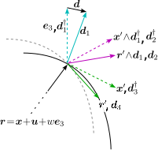{width=700px}

:::
:::

::: {.free-card style="--x:65%; --y:35%; --w:1500px; --rot:0deg; --z:0; --origin:50% 10%; --scale:0.7  "}
::: {.card-body}
$$v_{,\vartheta^n}=\frac{\mrm{d}^{n}}{\mrm{d}\vartheta^{n}}[T_{\vartheta}]_{1\times(2M+1)}[V]_{(2M+1)\times1}=[P_{n}]_{1\times(2M+1)}[V]_{(2M+1)\times1}$$

:::
:::

::: {.free-card style="--x:65%; --y:55%; --w:1200px; --rot:0deg; --z:0; --origin:50% 10%; --scale:0.7  "}
::: {.card-body}
$$\dd{1}=\mbs{d}+\dd{1}^{\gr},\, \dd{3}=\mbs{r}',\, \dd{2}=\dd{3}\W\dd{1}$$
$$(\dd{}+\dd{1}^{\gr})\cdot(\dd{}+\dd{1}^{\gr})=1 ,\quad \mbs{r}'\cdot\mbs{r}'=1, \quad(\mbs{d}+\dd{1}^{\gr})\cdot\mbs{r}'=0$$
:::
:::

::: {.free-card style="--x:55%; --y:75%; --w:1000px; --rot:0deg; --z:0; --origin:50% 10%; --scale:0.7  "}
::: {.card-body}
$$\Big(u_{r},u_{\vartheta},w, d_{r},d_{\vartheta},d_{3}, c_{1}, c_{2}, c_{3}\Big)$$
:::
:::

:::
# Results

## Results and discussion
::: {.fancy-slide style="--pad-bottom:920px"}
::: {.free-card style="--x:15%; --y:47%; --w:1200px; --rot:0deg; --z:1; --origin:50% 10%; --scale:0.45  "}
::: {.card-body}
***Engineering Parameters***

| Engineering parameters | A (Copper/Steel) | B (Pumpkin Flesh/Skin) | C (1:100) | D (100:1) |
|:--- |:---:|:---:|:---:|:---:|
| $E_{plate}$ | 110 GPa | 0.6 E | 1 GPa | 100 GPa |
| $\nu_{plate}$ | 0.34 | 0.5 | 0.3 | 0.3 |
| $h_{plate}$ | 0.002 m | 0.002 m | 0.002 | 0.002 |
| $E_{rod}$ | 200 GPa | 1 E | 100 GPa | 1 GPa |
| $\nu_{rod}$ | 0.3 | 0.3 | 0.3 | 0.3 |
| $\mathfrak{D}_R$ | 0.028 m | 0.028 m | 0.028 m | 0.028 m |
| rod diameter | 0.002 m | 0.002 m | 0.002 m | 0.002 m |
:::
:::

::: {.free-card style="--x:15%; --y:78%; --w:1300px; --rot:0deg; --z:1; --origin:50% 10%; --scale:0.44  "}
::: {.card-body}
***Problem Parameters***

| Parameter values | A | B | C | D |
|:--- |:---:|:---:|:---:|:---:|
| $\beta$ | 0.00276149 | 0.00214668 | 0.156278 | 0.0000156278 |
| $\gamma$ | 0.00212422 | 0.00165129 | 0.120214 | 0.0000120214 |
| $\nu$ | 0.34 | 0.5 | 0.3 | 0.3 |
| $h$ | 0.142857 | 0.142857 | 0.142857 | 0.142857 |
:::
:::

::: {.free-card style="--x:60%; --y:37%; --w:1200px; --rot:0deg; --z:2; --origin:50% 10%; --scale:1.5  "}
![Selected critical values and corresponding mode shapes for parameter set A[@das2025local]](images/par1paper2.svg){weidth=1200px}
:::

:::

::: {.notes}
Selected critical values and their corresponding mode shapes for structure parameter set A. ``Iso'' denotes an isometric view, and ``Top'' denotes a top view. The symbol $\circ$ and the magenta curves represent bifurcation points and local bifurcation curves, respectively, corresponding to $\mathtt{D}_k$ symmetry for $\lambda < 1$. The symbol $\times$ and the black curves are the bifurcation points and local bifurcation curves, respectively, corresponding to $\mathtt{Z}_k$ symmetry. The symbol $\diamond$ and the red curves are the bifurcation points and local bifurcation curves, respectively, corresponding to $\mathtt{O}(2)$ symmetry. The symbol $*$ and the blue curves are the bifurcation points and the bifurcation curves, respectively, corresponding to $\mathtt{D}_k$ symmetry when $\lambda > 1$.
:::

## Results and discussion (Bifurcation curves)
::: {.fancy-slide style="--pad-bottom:920px"}
::: {.free-card style="--x:20%; --y:37%; --w:720px; --rot:0deg; --z:1; --scale:1  " }
::: {.card-body}
![Set A[@das2025local]](images/parfig2/bifpar1.svg){width=1200px}
:::
:::

::: {.free-card style="--x:65%; --y:30%; --w:720px; --rot:0deg; --z:1; --scale:1  " .fragment}
::: {.card-body}
![Set B[@das2025local]](images/parfig2/bifpar2.svg){width=1200px}
:::
:::

::: {.free-card style="--x:35%; --y:70%; --w:720px; --rot:0deg; --z:1; --scale:1  " .fragment}
::: {.card-body}
![Set C[@das2025local]](images/parfig2/bifpar3.svg){width=1200px}
:::
:::

::: {.free-card style="--x:80%; --y:65%; --w:720px; --rot:0deg; --z:1; --scale:1  " .fragment}
::: {.card-body}
![Set D[@das2025local]](images/parfig2/bifpar4.svg){width=1200px}
:::
:::
:::

## Results and discussion (Post Buckled shape)

::: {.fancy-slide style="--pad-bottom:920px"}
::: {.free-card style="--x:52%; --y:57%; --w:1200px; --rot:0deg; --z:2; --origin:50% 10%; --scale:0.9  " }
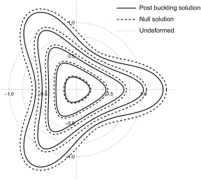{width=1200px}
:::
:::

## Results and discussion (Nature of Bifurcation)
::: {.fancy-slide style="--pad-bottom:920px"}
::: {.free-card style="--x:48%; --y:51%; --w:1200px; --rot:0deg; --z:1; --scale:0.9  " }
::: {.card-body}
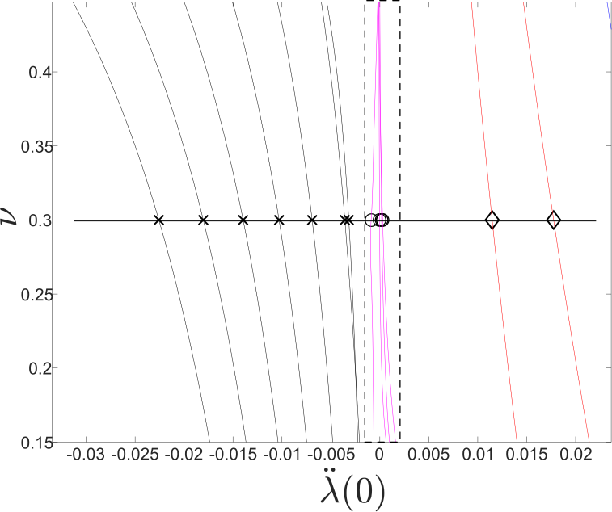{width=1200px}
:::
:::

::: {.free-card style="--x:51%; --y:54%; --w:1200px; --rot:0deg; --z:1; --scale:0.95  " .fragment}
::: {.card-body}
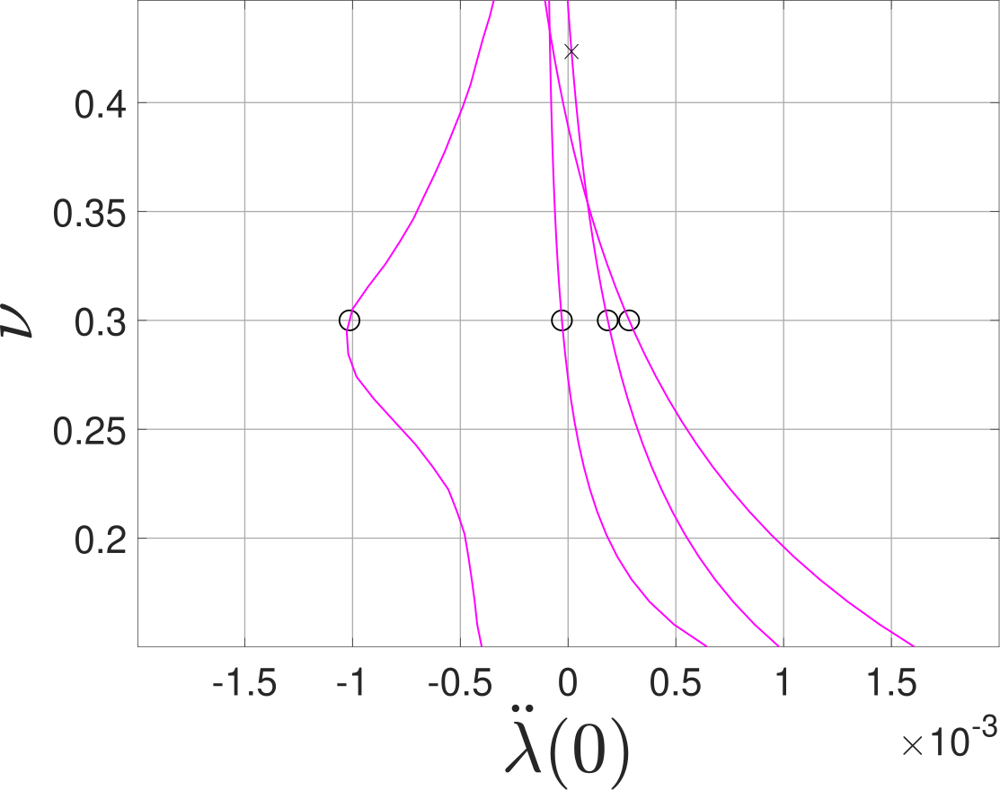{width=1200px}
:::
:::

::: {.free-card style="--x:50%; --y:53%; --w:1200px; --rot:0deg; --z:1; --scale:0.95  " .fragment}
::: {.card-body}
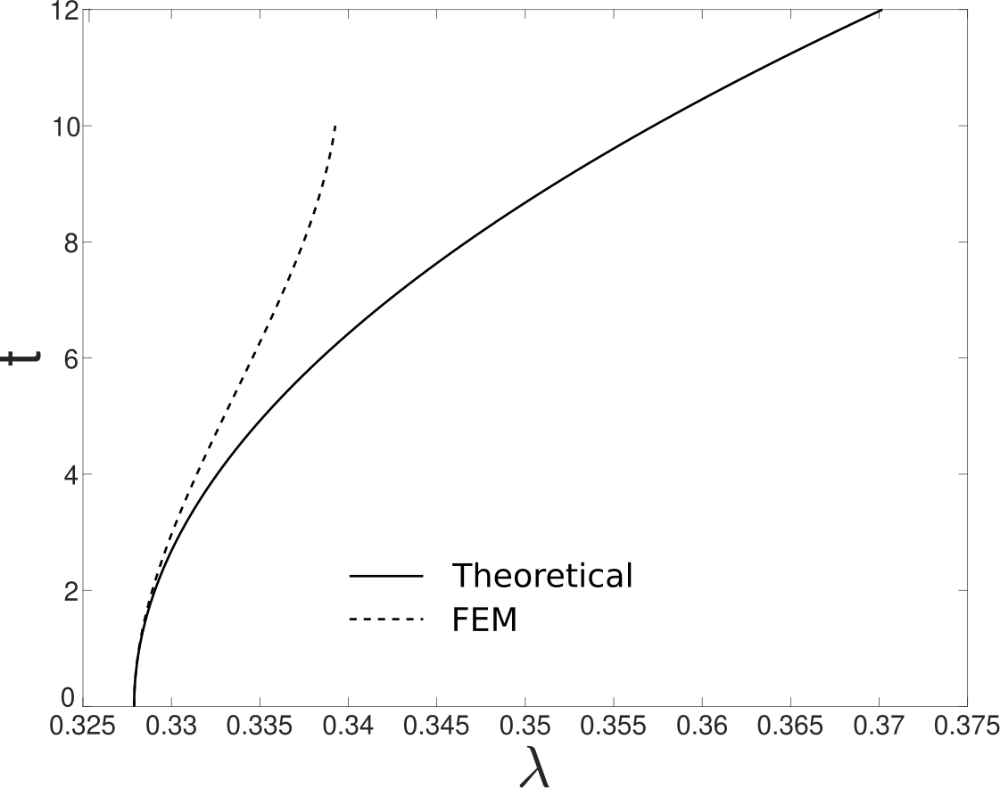{width=1200px}
:::
:::

:::

# Conclusion
## Summary
::: {.fancy-slide style="--pad-bottom:0px"}

**Geometric & Material Effects**

::: {.compact}
-   **$\lambda > 1$ (Plate > Rod):** Rod acts as a **Dirichlet boundary** due to inextensibility; no active influence on mode shapes.
-   **$\lambda < 1$:** Finite number of modes observed (planar and non-planar).
-   **Rod Twisting Stiffness:** Negligible impact on critical points and bifurcation curves (bending dominates).
-   **Soft Plates ($E_{plate} \ll E_{rod}$):** Emergence of intersecting sweep curves and high-dimensional null spaces, necessitating **symmetry-based reductions**.
:::

**Bifurcation & Stability**

::: {.compact}
-   All identified critical points are **bifurcation points**.
-   **Regime Transition:**
    -   Standard parameters: **Supercritical** (Stable).
    -   Soft plate limits: Transition to **Subcritical** (Unstable).
-   **FEM Validation:** Symmetry-reduced FEM successfully verified local supercritical behavior.
:::
**Limitations**

::: {.compact}
-   **von-Kármán Model:** Limited to small strains and moderate rotations (unsuitable for large 3D edge deformations).
-   **Kirchhoff Rod:** Restricts coupling behavior when the plate is under tension.
:::
:::

## Limitations & Future Work
::: {.fancy-slide style="--pad-bottom:60px"}

**Current Model Constraints**

::: {.compact}
-   **Rod vs. String:** Assumption of non-zero stiffness ($\Ebnd, \Etwst \neq 0$) limits applicability to **rods** (not strings).
-   **Deformation Limits:** Use of **von-Kármán** plate model restricts analysis to small deformations, despite the rod model's capability for large deformations.
:::
**Avenues for Future Research**

::: {.compact}
-   **Advanced Shell Models:** Adopt alternative models to study large post-buckling deformations.
-   **Chiral Rods:** Incorporate chiral models to better represent twisting stiffness effects.
-   **Symmetry Exploitation:** Further analysis of null space symmetries to map bifurcation branches.
:::

:::

## Key Contributions
::: {.fancy-slide style="--pad-bottom:60px"}
**Symmetry-Based Analytical Framework**

::: {.compact}
-   **Methodology:** Leverages **Lyapunov-Schmidt Reduction** for robust analysis of non-linear elasticity.
-   **Advantage over Commercial Software:**
    -   Commercial tools lack built-in symmetry detection.
    -   They struggle to trace closely spaced post-buckling curves.
    -   **Our Solution:** Partitions solution space by symmetry sub-groups to clearly separate and track distinct branches.
:::
**Framework Boundaries**

::: {.compact}
-   **Ellipticity:** Relies on governing PDEs being elliptic; **cannot** model plasticity or viscoelasticity.
-   **Idealized Symmetry:** Cannot detect solutions arising from **non-symmetric defects** (unless they align with a specific symmetry group).
:::

::: {.free-card style="--x:80%; --y:81%; --w:500px; --rot:-3deg; --z:1; --scale:0.7 " }
::: {.card-body}
![IJSS [@das2025local]](images/paper1snap.png){width=1200px}
:::
:::

::: {.free-card style="--x:50%; --y:81%; --w:500px; --rot:-3deg; --z:1; --scale:0.8 " }
::: {.card-body}
![SIAP [@das2025equilibriumcircularvonkarmanplate]](images/paper2snap.png){width=1200px}
:::
:::
:::

# {}
::: {.r-fit-text style="font-family: var(--r-heading-font); font-weight: bold;"}
THANK YOU
:::

# References {.unlisted}

::: {#refs}

:::

# Corrected Thesis {.unlisted}

<iframe data-src="files/Deepankar_Das_17205264_ME_revised_thesis_highlighted.pdf" width="100%" height="900px" style="border:1px solid #aaa;"></iframe>

# Review Report {.unlisted}

<iframe data-src="files/Deepankar_Das_17205264_ME_Response.pdf" width="100%" height="900px" style="border:1px solid #aaa;"></iframe>
